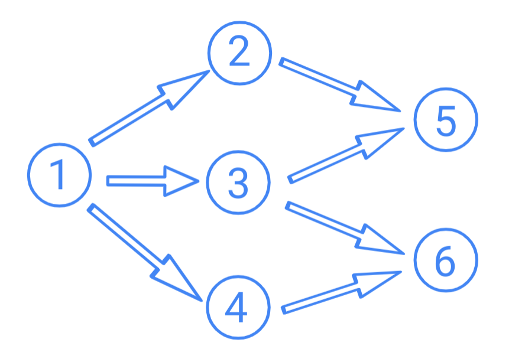

## Explanation of Concepts

To make the most of the GPU and support architecture-free networks it's best if the structure and state of the neural network is represented by a series of matrices.

### Instance / Constructor Matrices

**Connection / Weight Matrix**

This matrix is always a square matrix with a side-length equal to the amount of neurons in the network.

|   |  1  |  2  |  3  |  4  | 5 | 6 |
|:-:|:---:|:---:|:---:|:---:|:-:|:-:|
| **1** |  0  |  0  |  0  |  0  | 0 | 0 |
| **2** | [wa, wb, wc] |  0  |  0  |  0  | 0 | 0 |
| **3** | [wa, wb, wc] |  0  |  0  |  0  | 0 | 0 |
| **4** | [wa, wb, wc] |  0  |  0  |  0  | 0 | 0 |
| **5** |  0  | [w] | [w] |  0  | 0 | 0 |
| **6** |  0  |  0  | [w] | [w] | 0 | 0 |

**Current, Previous Activation, Error, Previous Error**

This matrix is a 6 by N matrix that contains information about the current & previous activation, error values. 

|    |  1  |  2  |  3 |  4  |  5  |  6  |
|:--:|:---:|:---:|:--:|:---:|:---:|:---:|
|  x | 1.2 |  2  |  4 |  4  |  4  |  5  |
| x' |  2  |  3  |  4 |  4  |  4  |  4  |
|  ε |  2  |  3  |  4 |  4  |  2  |  2  |
| ε' |  2  |  2  |  2 |  4  |  4  |  4  |

**Activation, Error, Optimizer**

This contains the per-neuron corresponding activation, error, and optimizer function 

|    | 1 | 2 | 3 | 4 | 5 | 6 |
|:--:|:-:|:-:|:-:|:-:|:-:|:-:|
|  f | 2 | 2 | 4 | 4 | 3 | 3 |
| f' | 2 | 3 | 4 | 4 | 4 | 4 |
|  ε | 2 | 3 | 4 | 4 | 2 | 2 |
| ε' | 2 | 2 | 2 | 4 | 4 | 4 |
|  Θ | 2 | 2 | 2 | 2 | 2 | 1 |
| Θ' | 1 | 3 | 4 | 2 | 1 | 3 |

### Serialized Kernels

These kernels contained serialized references to their corresponding functions

## Resources

### GPU Acceleration:
- OpenGL
- WebGL
- OpenCL
- DirectX
- Vulkan (Doom)
- Direct3D
- Metal
- SDL

### GPU JS Libraries:
- GPU.js
- gl (https://github.com/stackgl/headless-gl) - Used by GPU.js
- regl
- node-webgl
- node-gles (https://github.com/google/node-gles)
- CL.js (https://github.com/graphistry/cljs) - Manage GPUs from Node.js or JavaScript
- Node OpenCL (https://github.com/mikeseven/node-opencl) - Used by (https://github.com/jeffallen6767/chain)
- Node GPU (https://github.com/kuebk/node-gpu) - GPU Support in Node.js & JavaScript (only AMD/ADL3/ATI - not NVIDIA)

### GPU JS Examples:
- Chain (https://github.com/jeffallen6767/chain) - Blockchain Mining in JS

### CUDA Code Examples:
- Multi GPU Programming Models (https://github.com/NVIDIA/multi-gpu-programming-models)

### GPU Hosting Providers:
- Paperspace (https://www.paperspace.com/)
- LeaderGPU (https://www.leadergpu.com/)
- GPU Eater (https://www.gpueater.com/) - Hosted at Oak Ridge National Laboratory; Emily Costa is associated.

### Image Processing Resources:
- (https://github.com/bigsnarfdude/tfjs-node-webgl-gpu-example) - Has an example code snippet of serializing .jpegs for NN consumption.

### Miscellaneous GPU Code:
- Nodes Info (https://github.com/twuilliam/nodes-info) - Educational resources on creating/managing GPU clusters
- Node.js2CUDA (https://github.com/packetlost/node-js2cuda) - Pure JavaScript for CUDA Compilation: Translates JS code to CUDA and launches compiled code on GPU

### JavaScript Code Parsing Utilities:
- Esprima (https://esprima.org/) - ES Parsing Infrastructure for Analysis
- Estraverse (https://github.com/estools/estraverse) - ES Traversal Function
- ESQuery (https://github.com/estools/esquery) - Query Language for Esprima AST Output
- AST Types (https://github.com/benjamn/ast-types) - Esprima Compatible AST Types

### Python GPU Examples:
- DIGITS (https://github.com/NVIDIA/DIGITS) - A curation of different techniques for detecting hand-written digits.
- Fast.ai (https://github.com/fastai/fastai) - A Python Deep Learning Framework
- NeuralMT (https://github.com/zomux/neuralmt) -  Large-scale NN training on multiple node/GPUs

### Python GPU Tools:
- GPU Stat (https://github.com/wookayin/gpustat) - GPU Query & Monitoring Tool
